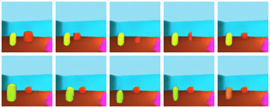
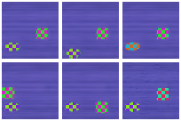
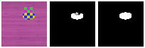

# Learning-to-manipulate-individual-objects-in-an-image-Implementation
This repo contains the implementation of the method described in the paper

[Learning to Manipulate Individual Objects in an Image](https://arxiv.org/pdf/2004.05495.pdf)  

Published in the International Conference of Computer Vision and Pattern Recognition (CVPR) 2020.


### Introduction:
We describe a method to train a generative model with latent factors that are (approximately) independent and localized. This means that perturbing the latent variables affects only local regions of the synthesized image, corresponding to objects. Unlike other unsupervised generative models, ours enables object-centric manipulation, without requiring object-level annotations, or any form of annotation for that matter. For more details, please check our paper.

<p align="center">


<p>
 
<p align="center">

<p>
 


## Running the code
### Prerequisites

This code was tested with the following packages. Note that other version of them might work but are untested.

* Ubuntu 16.04
* python3
* tensorflow-gpu==1.14.0
* python-gflags 3.1.2
* keras 2.3.1
* imageio 2.6.1
* numpy 1.17.2
* gitpython 3.0.5

### Datasets


#### Multi-dSprites and Objects Room

Download two existing datasets with the following commands:
```
mkdir data/multi_dsprites_data data/objects_room_data
wget https://storage.googleapis.com/multi-object-datasets/multi_dsprites/multi_dsprites_colored_on_colored.tfrecords -P data/multi_dsprites_data
wget https://storage.googleapis.com/multi-object-datasets/objects_room/objects_room_train.tfrecords -P data/objects_room_data
```
These two datasets are TFRecords files and can be used without pre-processing.


#### Multi-Texture

The components are already included in [data/multi\_texture\_data](data/multi_texture_data) and will be automatically used to generate images online while training and testing.


#### Flying Animals

Please download the zip file from 
[this link](https://drive.google.com/open?id=1xs9CdR8HC_RxfuEbZnD_hmMqQusAuhbO), put it in [data/flying\_animals\_data](data/flying_animals_data) and then run the following commands to decode the raw images into .npz file.
```
cd  data/flying_animals_data
unzip data.zip
python fa_data_decode.py
```
These commands generate img_data.npz and img_data_test.npz in [data/flying\_animals\_data](data/flying_animals_data) for training and testing

### Training

To stabilize and speed up adversarial training, our training consists of four steps. Default hyperparameters settings for four datasets and four steps are included in script/dataset\_name. Please modify some arguments, e.g. the path of output checkpoints, in scripts when necessary. 

#### 1.Pretrain inpainting network

Pretrain inpainting network on the task of predicting pixels on box-shaped occlusions.
```
sh script/dataset_name/pretrain_inpainter.sh
```
Pretrained checkpoints of inpainting network for each dataset can be downloaded [here](). You can directly restore the downloaded checkpoint to skip this step.

#### 2.Spatial disentanglement

Update inpainting network and segmentation network adversarially for spatial disentanglement.

```
sh script/dataset_name/train_CIS.sh
```
Note that while for other datasets we train segmentation network from scratch, for flying animals dataset we suggest initializing ResNetV2-50 with checkpoint pretrained on ImageNet which can be found [here](https://github.com/tensorflow/models/tree/master/research/slim#pre-trained-models). Please download the checkpoint by running
```
mkdir resnet && cd resnet
wget http://download.tensorflow.org/models/resnet_v2_50_2017_04_14.tar.gz
tar -xvf resnet_v2_50_2017_04_14.tar.gz
```

#### 3.Train VAE
```
sh script/dataset_name/train_VAE.sh
```
Train encoder and decoder with segmentation network fixed to learn disentangled latent space.

#### 4.End2end finetune
```
sh script/dataset_name/train_end2end.sh
```
Jointly train all modules.

### IoU Evaluation

For a trained model, you can measure its segmentation performance with the function [test\_segmentation.py](./test_segmentation.py). Examples of test script are provided as script/dataset_name/test_segmentation.sh. Edit it with the path to the checkpoint file and run it to compute the mean and standard variance of mean-IoU scores on 10 subsets.
```
sh script/dataset_name/test_segmentation.sh
```

### Disentanglement 

After finishing all training steps, you can visualize the latent space's disentanglement by feeding a target image into the model and varying one latent dimension at a time to see if the perturbation only leads to one type of semantic variation of one particular object in the synthesized image. 

Script examples for disentanglement visualization are provided as script/dataset_name/disentanglement.sh. Edit them with paths to checkpoint and output directories. 
```
sh script/dataset_name/disentanglement.sh
```
Modify some of the arguments when necessary to set which objects and dimensions to perturb and the range of varying latent factors.

### Perceptual cycle-consistency
We demonstrate the effectiveness of perceptual cycle-consistency constrain on Multi-Texture with each image including two objects of different identities, ellipse and square. Training scripts of the experiments are provided in [scripts/PC](./ scripts/PC). The first three training steps are the same as mentioned in (./README.md#Training) without enforcing perceptual cycle-consistency constrain. Then we finetune the model with perceptual cycle-consistency constrain by running [scripts/PC/](./ scripts/PC). It can be observed that the finetuning decreases identity switching rate and improves identity consistency. In the figure below, we compare the segmentation behaviors between two models before and after the finetuning by visualizing their channel 0¡¯s segmentation for the same image sequence. Note that finetuned model (middle) consistently captures ellipse in channel 0 while un-finetuned model (right) can assign square to channel 0 sometimes.
<p align="center">

<p>
 


To compute identity switching, run [script/dataset_name/test_segmentation.sh] (script/pc/test_segmentation.sh) to compute identity switching rate of the tested segmentation network.)  We provide checkpoints for two models in . If you¡¯d like to explore the effectiveness by yourself, we recommend downloading the model that has been trained for the first three steps and finetuning it using [scripts/PC/](./ scripts/PC).

## Downloads
## Citation

